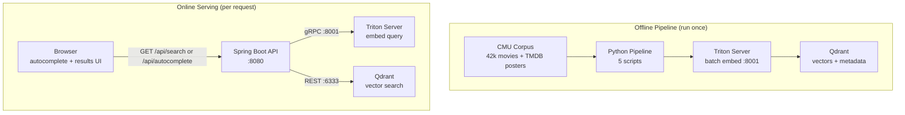

# Architecture Overview

End-to-end system for semantic search over ~42,000 CMU movie plot summaries. Click any component node to drill into its detail page.

## Components

| Component | Detail Page | Role |
|---|---|---|
| Python Pipeline | [pipeline.md](arch/pipeline.md) | Offline: download corpus, export model, embed, ingest, enrich with TMDB posters |
| Triton Inference Server | [triton.md](arch/triton.md) | Serve `all-MiniLM-L6-v2` over gRPC; text in → float32[384] out |
| Qdrant | [qdrant.md](arch/qdrant.md) | Store 384-dim vectors + movie metadata; cosine similarity search |
| Spring Boot API | [api.md](arch/api.md) | HTTP endpoints, orchestrate Triton + Qdrant, serve UI |

## Data Flow

**Offline (once):** CMU corpus → Python scripts → Triton (batch embed 42k summaries) → Qdrant (index vectors) → TMDB enrichment (add poster URLs)

**Online (per request):** Browser query → Spring Boot → Triton (embed query) → Qdrant (top-N cosine search) → JSON response → Browser
