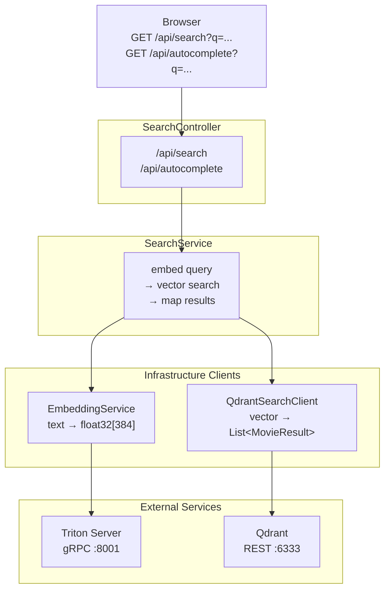

# Spring Boot API Component

Java 21 + Spring Boot 3 application. Orchestrates Triton and Qdrant to serve search requests, and serves the frontend UI.



## Java Class Responsibilities

### `SearchController`
- `GET /api/search?q={query}&limit={n}` — full search, default limit 10, max 50
- `GET /api/autocomplete?q={partial}` — autocomplete, always limit 3
- Validates `q` is non-blank; returns 400 if missing
- Delegates to `SearchService`

### `SearchService`
- Calls `EmbeddingService.embed(q)` → `float[]`
- Calls `QdrantSearchClient.search(vector, limit)` → `List<MovieResult>`
- Maps raw Qdrant payload to `MovieResult` objects
- Wraps response in `SearchResponse` with query string and count

### `EmbeddingService`
- Wraps `TritonClient`
- Marshals `String text` → gRPC `InferRequest` → parses `InferResponse` → `float[]`
- Throws `EmbeddingServiceException` (→ HTTP 503) if Triton is unreachable

### `TritonClient`
- `float[] embed(String text)`
- Constructs Triton gRPC `ModelInferRequest` with `TEXT` input tensor
- Parses `ModelInferResponse`, extracts `sentence_embedding` output as `float[]`

### `QdrantSearchClient`
- `List<MovieResult> search(float[] vector, int limit)`
- HTTP POST to `{qdrant.base-url}/collections/movies/points/search`
- Deserializes response payload into `MovieResult` list
- Throws `SearchServiceException` (→ HTTP 503) if Qdrant is unreachable

### `MovieResult`
```java
String title
Integer year          // null if not in payload
List<String> genres
float score           // cosine similarity 0.0–1.0
String summarySnippet
String thumbnailUrl   // null if not enriched
```

### `SearchRequest`
```java
String q              // required, non-blank
int limit             // default 10, max 50 (max 3 for autocomplete)
```

## `application.yml` Config Keys

```yaml
triton:
  host: localhost
  port: 8001

qdrant:
  base-url: http://localhost:6333

search:
  default-limit: 10

autocomplete:
  limit: 3

tmdb:
  poster-base-url: https://image.tmdb.org/t/p/w200
```

## `pom.xml` Key Dependencies

```xml
<!-- Web -->
<dependency>spring-boot-starter-web</dependency>

<!-- gRPC for Triton -->
<dependency>grpc-netty-shaded</dependency>
<dependency>protobuf-java</dependency>
<!-- Triton gRPC stubs (grpc-client-java or generated from tritonclienttools) -->

<!-- JSON (included via spring-boot-starter-web) -->
<!-- jackson-databind -->

<!-- Testing -->
<dependency>spring-boot-starter-test</dependency>
```

---

## UI Specification (`src/main/resources/static/index.html`)

Single-page HTML/JS/CSS. No build toolchain. Served directly by Spring Boot from the classpath static directory.

### Search Bar

- Centered at top of page
- Text input + submit button
- Submitting fires a full search (`GET /api/search`)

### Autocomplete Dropdown

- Triggers on `input` event, debounced **300ms**, minimum **2 characters**
- Calls `GET /api/autocomplete?q={partial}`
- Renders a dropdown below the search bar with ≤3 results
- Each result row:
  - `` poster thumbnail — 40×60px, src = `{tmdb.poster-base-url}{thumbnail_url}`; hidden if `thumbnail_url` is null
  - Movie title (bold) + release year
- Clicking a result: populates the search bar with the title and fires a full search
- Dropdown dismisses on outside click or Escape key

### Full Results Table

- Triggered on form submit or autocomplete selection
- Calls `GET /api/search?q={query}&limit=20`
- Shows loading spinner while request is in flight
- Shows error message row if request fails
- Table columns:

| Column | Content |
|---|---|
| Poster | `` 80×120px; fallback placeholder if `thumbnail_url` is null |
| Title + metadata | Title (bold), year, genres as inline tags |
| Summary | `summary_snippet` truncated to 200 chars with ellipsis |
