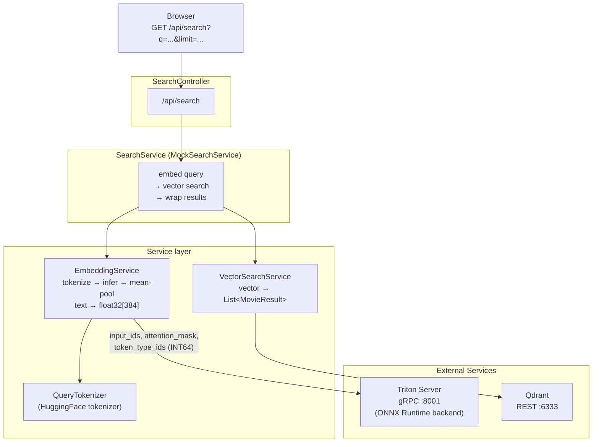

# Spring Boot API Component

Java 21 + Spring Boot 3 application. Orchestrates Triton and Qdrant to serve search requests, and serves the frontend UI.


```mermaid
flowchart TD
  BROWSER["Browser\nGET /api/search?q=...&limit=..."]

  subgraph Controller["SearchController"]
    SC["/api/search"]
  end

  subgraph Service["SearchService (MockSearchService)"]
    SS["embed query\n→ vector search\n→ wrap results"]
  end

  subgraph Clients["Service layer"]
    ES["EmbeddingService\ntokenize → infer → mean-pool\ntext → float32[384]"]
    TOK["QueryTokenizer\n(HuggingFace tokenizer)"]
    QC["VectorSearchService\nvector → List&lt;MovieResult&gt;"]
  end

  subgraph External["External Services"]
    TRITON["Triton Server\ngRPC :8001\n(ONNX Runtime backend)"]
    QDRANT["Qdrant\nREST :6333"]
  end

  BROWSER --> SC --> SS
  SS --> ES
  ES --> TOK
  ES -->|"input_ids, attention_mask,\ntoken_type_ids (INT64)"| TRITON
  SS --> QC --> QDRANT
```

> Note: the sole `SearchService` implementation is named `MockSearchService` for historical
> reasons, but it is the real production path — it always delegates to the live
> `EmbeddingService` and `VectorSearchService`.

## Java Class Responsibilities

### `SearchController`
- `GET /api/search?q={query}&limit={n}` — full search; `limit` defaults to 10, clamped to max 50, must be ≥ 1
- Validates `q` is non-blank and ≤ 500 chars; returns 400 (`ProblemDetail`) otherwise
- Delegates to `SearchService`
- There is **no** `/api/autocomplete` endpoint — the UI does autocomplete by calling `/api/search` with `limit=3`

### `SearchService` (interface; impl `MockSearchService`)
- `SearchResponse search(SearchRequest request)`
- Calls `EmbeddingService.embed(EmbeddingRequest)` → `EmbeddingResponse` (`float[] vector`)
- Calls `VectorSearchService.search(VectorSearchRequest)` → `VectorSearchResponse` (`List<MovieResult>`)
- Wraps results in `SearchResponse` with the query, limit, and result count

### `EmbeddingService` (interface; impl `EmbeddingServiceImpl`)
- `EmbeddingResponse embed(EmbeddingRequest request)`
- Tokenizes the query via `QueryTokenizer` (max_length 128)
- Builds a gRPC `ModelInferRequest` with `input_ids`, `attention_mask`, `token_type_ids` (all INT64)
- Requests the `token_embeddings` output and **mean-pools** it (attention-mask weighted) to `float[384]`
- Throws `EmbeddingServiceException` (→ HTTP 503) if Triton is unreachable
- A `MockEmbeddingService` is wired instead when `triton.mock=true`

### `QueryTokenizer` (interface; impl `HuggingFaceQueryTokenizer`)
- `TokenizedInput tokenize(String text)` → `input_ids`, `attention_mask`, `token_type_ids`
- Backed by the DJL HuggingFace tokenizer binding, loading the same `tokenizer.json` as the pipeline

### `VectorSearchService` (interface; impl `VectorSearchServiceImpl`)
- `VectorSearchResponse search(VectorSearchRequest request)`
- HTTP POST to `{qdrant.base-url}/collections/movies/points/search`
- Maps Qdrant's snake_case payload (`release_year`, `thumbnail_url`, …) to `MovieResult`
- Throws `VectorSearchServiceException` (→ HTTP 503) if Qdrant is unreachable

### `MovieResult`
```java
String title
Integer year          // null if not in payload
List<String> genres
float score           // cosine similarity 0.0–1.0
String summarySnippet
String thumbnailUrl   // null if not enriched
```

### `SearchRequest`
```java
String query          // required, non-blank (HTTP param is `q`)
int limit             // default 10, clamped to max 50
```

## `application.yml` Config Keys

```yaml
triton:
  host: ${TRITON_HOST:localhost}
  port: 8001
  model-name: all-minilm-l6-v2
  deadline-ms: 5000
  # mock: false              # when true, wires MockEmbeddingService

qdrant:
  base-url: ${QDRANT_BASE_URL:http://localhost:6333}
  mock: false

search:
  default-limit: 10

autocomplete:
  limit: 3                    # config key exists; no dedicated endpoint — UI passes limit=3 to /api/search

tmdb:
  poster-base-url: https://image.tmdb.org/t/p/w200
  api-key: ${TMDB_API_KEY:}
```

(The operator dashboard adds further keys — `dataset.*`, `model.*`, `project.root` — see `docs/arch/operator.md`.)

## `pom.xml` Key Dependencies

```xml
<!-- Web + validation -->
<dependency>spring-boot-starter-web</dependency>
<dependency>spring-boot-starter-validation</dependency>

<!-- gRPC for Triton -->
<dependency>grpc-netty-shaded</dependency>
<dependency>grpc-protobuf</dependency>
<dependency>grpc-stub</dependency>
<dependency>javax.annotation-api</dependency>

<!-- HuggingFace tokenizer (client-side query tokenization) -->
<dependency>ai.djl.huggingface:tokenizers</dependency>

<!-- OpenAPI / Swagger UI -->
<dependency>springdoc-openapi-starter-webmvc-ui</dependency>

<!-- Testing -->
<dependency>spring-boot-starter-test</dependency>
```

---

## UI Specification (`src/main/resources/static/index.html`)

Single-page HTML/JS/CSS. No build toolchain. Served directly by Spring Boot from the classpath static directory.

### Search Bar

- Centered at top of page
- Text input + submit button
- Submitting fires a full search (`GET /api/search`)

### Autocomplete Dropdown

- Triggers on `input` event, debounced **300ms**, minimum **2 characters**
- Calls `GET /api/search?q={partial}&limit=3` (no dedicated autocomplete endpoint exists)
- Renders a dropdown below the search bar with ≤3 results
- Each result row:
  - `` poster thumbnail — 40×60px, src = `{tmdb.poster-base-url}{thumbnail_url}`; hidden if `thumbnail_url` is null
  - Movie title (bold) + release year
- Clicking a result: populates the search bar with the title and fires a full search
- Dropdown dismisses on outside click or Escape key

### Full Results Table

- Triggered on form submit or autocomplete selection
- Calls `GET /api/search?q={query}&limit=10`
- Shows loading spinner while request is in flight
- Shows error message row if request fails
- Table columns:

| Column | Content |
|---|---|
| Poster | `` 80×120px; fallback placeholder if `thumbnail_url` is null |
| Title + metadata | Title (bold), year, genres as inline tags |
| Summary | `summary_snippet` truncated to 200 chars with ellipsis |
