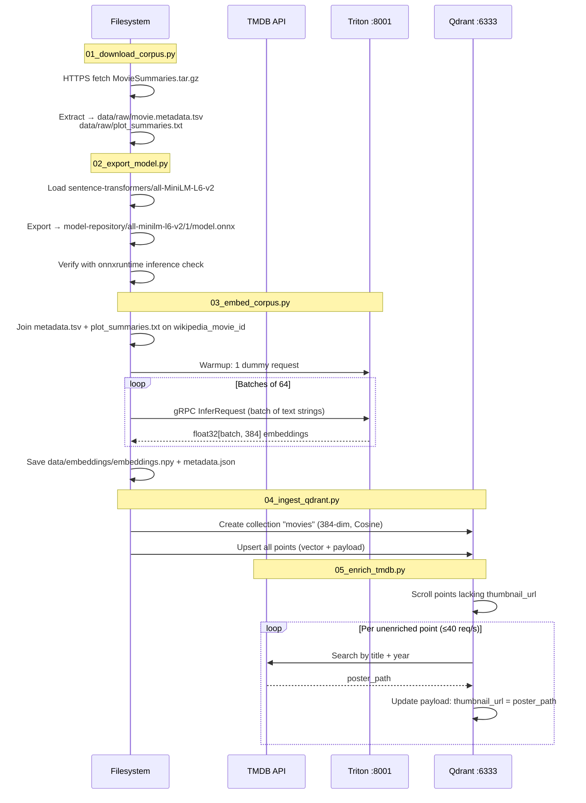

# Pipeline Component

Five Python scripts that build the search index, executed in two phases. Scripts 01–02 (`load-model` phase) run before services start and export the ONNX model to the Triton model repository. Scripts 03–05 (`load-data` phase) run after services are healthy and require Triton and Qdrant to be reachable.



## Scripts

### `01_download_corpus.py`

- Source: `https://www.cs.cmu.edu/~ark/personas/data/MovieSummaries.tar.gz`
- Extracts to `data/raw/`
- Output files:
  - `movie.metadata.tsv` — 9 columns, tab-separated
  - `plot_summaries.txt` — 2 columns: `wikipedia_movie_id`, plot text
- Idempotent: skips download if files already exist

### `02_export_model.py`

- Loads `sentence-transformers/all-MiniLM-L6-v2` from HuggingFace
- Exports ONNX model and saves tokenizer files to `model-repository/all-minilm-l6-v2/1/`:
  - `model.onnx`
  - `tokenizer.json`
  - `tokenizer_config.json`
  - `vocab.txt`
  - `special_tokens_map.json`
- Runs a verification inference with `onnxruntime` to confirm the export is valid
- Idempotent: skips export if `model.onnx` **and** `tokenizer.json` both exist

ONNX tensor names produced by this export:

| Direction | Name | dtype | Shape |
|---|---|---|---|
| Input | `input_ids` | int64 | `[batch, seq]` |
| Input | `attention_mask` | int64 | `[batch, seq]` |
| Input | `token_type_ids` | int64 | `[batch, seq]` |
| Output | `token_embeddings` | float32 | `[batch, seq, 384]` |

`model.py` mean-pools `token_embeddings` over the sequence dimension (weighted by
`attention_mask`) to produce the final `[batch, 384]` sentence embedding.

### `03_embed_corpus.py`

- Reads `movie.metadata.tsv` and `plot_summaries.txt`
- Joins on `wikipedia_movie_id`; skips movies with no summary or no metadata
- Sends warmup request to Triton before batch processing
- Batch size: 64 (configurable via `--batch-size`)
- Saves:
  - `data/embeddings/embeddings.npy` — float32 array of shape `[N, 384]`
  - `data/embeddings/metadata.json` — list of `{movie_id, title, release_year, genres, summary_snippet}` in the same order

### `04_ingest_qdrant.py`

- Creates Qdrant collection `movies` with:
  - `vectors.size = 384`
  - `vectors.distance = Cosine`
- Upserts all points. Payload per point:
  ```
  movie_id:        string        (wikipedia_movie_id, cast to string)
  title:           string
  release_year:    integer|null  (parsed from release_date field)
  genres:          string[]      (parsed from JSON map in metadata TSV)
  summary_snippet: string        (first 300 chars of plot_summaries.txt)
  thumbnail_url:   string|null   (null at this stage; populated by script 05)
  ```
- Idempotent: recreates collection cleanly on re-run

### `05_enrich_tmdb.py`

- Requires `TMDB_API_KEY` environment variable
- Scrolls all Qdrant points where `thumbnail_url` is null
- For each: searches TMDB by `title + release_year`, takes first result's `poster_path`
- Updates Qdrant payload: `thumbnail_url = "/abc123.jpg"` (poster path only; prepend base URL at display time)
- Rate-limited to **40 req/s** (TMDB free tier limit)
- Idempotent: skips points that already have `thumbnail_url` set
- If TMDB returns no match, `thumbnail_url` remains null

## `requirements.txt` (pinned versions)

```
sentence-transformers==2.7.0
tritonclient[grpc]==2.44.0
qdrant-client==1.9.1
requests==2.31.0
numpy==1.26.4
tqdm==4.66.4
onnxruntime==1.17.3
```
