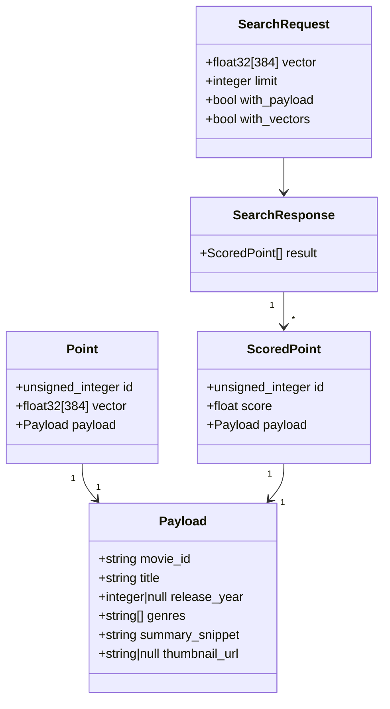

# Qdrant Component

Vector database storing 384-dimensional embeddings and movie metadata. Handles cosine similarity search at query time.


```mermaid
classDiagram
  class Point {
    +unsigned_integer id
    +float32[384] vector
    +Payload payload
  }

  class Payload {
    +string movie_id
    +string title
    +integer|null release_year
    +string[] genres
    +string summary_snippet
    +string|null thumbnail_url
  }

  class SearchRequest {
    +float32[384] vector
    +integer limit
    +bool with_payload
    +bool with_vectors
  }

  class SearchResponse {
    +ScoredPoint[] result
  }

  class ScoredPoint {
    +unsigned_integer id
    +float score
    +Payload payload
  }

  Point "1" --> "1" Payload
  SearchRequest --> SearchResponse
  SearchResponse "1" --> "*" ScoredPoint
  ScoredPoint "1" --> "1" Payload
```

## Collection Configuration

```
name:              movies
vectors.size:      384
vectors.distance:  Cosine
```

**Point ID:** a sequential integer index (`0 … N-1`) assigned at ingest time, matching each
embedding's position in `embeddings.npy` / `metadata.json` (see `04_ingest_qdrant.py`). It is
**not** the Wikipedia movie ID. The Wikipedia movie ID is stored separately as a string in the
`movie_id` payload field.

## Payload Schema

| Field | Type | Notes |
|---|---|---|
| `movie_id` | `string` | Wikipedia movie ID, stored as string for safety |
| `title` | `string` | Movie title from CMU metadata |
| `release_year` | `integer \| null` | Parsed from `release_date` field; null if unparseable |
| `genres` | `string[]` | Parsed from JSON map in metadata TSV (keys only) |
| `summary_snippet` | `string` | First 300 characters of plot summary |
| `thumbnail_url` | `string \| null` | TMDB poster path, e.g. `"/abc123.jpg"` — Qdrant stores the relative path; the Spring Boot API prepends the base URL before returning it on `/api/search`. |

**TMDB poster base URL (assembled by the API):** `https://image.tmdb.org/t/p/w200{poster_path}`

Example full URL returned by the API: `https://image.tmdb.org/t/p/w200/abc123.jpg`

## Search Request

`POST /collections/movies/points/search`

```json
{
  "vector": [0.021, -0.047, 0.183, "...384 floats total"],
  "limit": 10,
  "with_payload": true,
  "with_vectors": false
}
```

## Search Response

```json
{
  "result": [
    {
      "id": 4213,
      "score": 0.8741,
      "payload": {
        "movie_id": "975900",
        "title": "Cast Away",
        "release_year": 2000,
        "genres": ["Drama", "Adventure"],
        "summary_snippet": "A FedEx executive undergoes a physical and personal transformation...",
        "thumbnail_url": "/uVlUu174iiKLBgcNnDOCFR8LNKP.jpg"
      }
    }
  ]
}
```

## Docker Configuration

- **Image:** `qdrant/qdrant:v1.9.2`
- **Ports:**
  - `:6333` — REST API + web dashboard (used by API and pipeline)
  - `:6334` — gRPC
- **Volume mount:** named volume `qdrant_data:/qdrant/storage` (declared under `volumes:` in `docker-compose.yml`)
