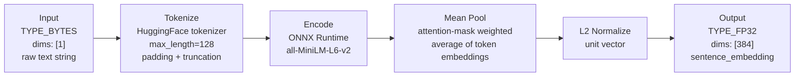

# Triton Inference Server Component

Serves `all-MiniLM-L6-v2` over gRPC. Accepts raw text strings, returns 384-dimensional float32 embedding vectors.



## Model Repository Structure

```
model-repository/
  all-minilm-l6-v2/
    config.pbtxt          ← committed
    requirements.txt      ← committed
    1/
      model.py            ← committed
      model.onnx          ← generated by 02_export_model.py
      tokenizer.json      ← generated by 02_export_model.py
      tokenizer_config.json
      vocab.txt
      special_tokens_map.json
```

Files marked **committed** are checked into git. Files marked **generated** are produced
by `02_export_model.py` and must be present before starting the Triton container.

### `requirements.txt`

Triton's Python backend auto-installs `requirements.txt` from the model root at startup:

```
transformers==4.39.3
onnxruntime==1.17.3
```

`model.py`'s `initialize()` loads the tokenizer with:
```python
AutoTokenizer.from_pretrained(os.path.join(args["model_repository"], args["model_version"]))
```

## `config.pbtxt`

```protobuf
name: "all-minilm-l6-v2"
backend: "python"

input [
  {
    name: "TEXT"
    data_type: TYPE_BYTES
    dims: [1]
  }
]

output [
  {
    name: "sentence_embedding"
    data_type: TYPE_FP32
    dims: [384]
  }
]

dynamic_batching {
  preferred_batch_size: [8, 16]
  max_queue_delay_microseconds: 5000
}
```

## `model.py` Interface

```python
class TritonPythonModel:
    def initialize(self, args):
        # Load tokenizer from model directory
        # Load ONNX session via onnxruntime.InferenceSession

    def execute(self, requests):
        # For each request:
        #   1. Extract TEXT bytes → decode to string
        #   2. Tokenize: input_ids, attention_mask, token_type_ids (max_length=128)
        #   3. session.run(["token_embeddings"],
        #                  {"input_ids": ..., "attention_mask": ..., "token_type_ids": ...})
        #   4. Mean pool [batch, seq, 384] → [batch, 384], weighted by attention_mask
        #   5. L2-normalize → unit vector [batch, 384]
        #   6. Return sentence_embedding output
```

## Docker Configuration

- **Image:** `nvcr.io/nvidia/tritonserver:24.01-py3`
- **Ports:**
  - `:8000` — HTTP (health + metrics)
  - `:8001` — gRPC (inference — used by pipeline and API)
  - `:8002` — Prometheus metrics
- **Startup flags:** `--model-repository=/models --log-verbose=0`
- **Volume mount:** `./model-repository:/models`

## Key Design Decisions

**Python backend vs raw ONNX backend**

The raw ONNX backend accepts pre-tokenized tensors (input_ids, attention_mask) and returns raw token logits. The caller would need to handle tokenization and mean pooling. The Python backend accepts raw text and returns the final embedding — keeping the gRPC interface simple (text in, vector out) and tokenization co-located with the model.

Tradeoff: Python backend has slightly higher per-request overhead than native backends. Acceptable for this workload.

**CPU vs GPU**

TensorRT (GPU optimization) is excluded because no NVIDIA GPU is available in the development environment. The ONNX Runtime CPU backend is used. `all-MiniLM-L6-v2` is fast enough on CPU for a portfolio demo (sub-100ms per embedding).
