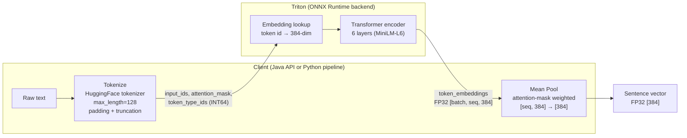

# Triton Inference Server Component

Serves `all-MiniLM-L6-v2` over gRPC using the **ONNX Runtime backend**. Accepts pre-tokenized tensors (input_ids, attention_mask, token_type_ids) and returns per-token contextual embeddings. Tokenization and mean pooling happen on the **client** side (the Python pipeline during indexing, the Java API at query time).


```mermaid
flowchart LR
  subgraph Client["Client (Java API or Python pipeline)"]
    TXT["Raw text"]
    TOK["Tokenize\nHuggingFace tokenizer\nmax_length=128\npadding + truncation"]
    POOL["Mean Pool\nattention-mask weighted\n[seq, 384] → [384]"]
  end

  subgraph Triton["Triton (ONNX Runtime backend)"]
    LOOKUP["Embedding lookup\ntoken id → 384-dim"]
    ENC["Transformer encoder\n6 layers (MiniLM-L6)"]
  end

  TXT --> TOK
  TOK -->|"input_ids, attention_mask,\ntoken_type_ids (INT64)"| LOOKUP
  LOOKUP --> ENC
  ENC -->|"token_embeddings\nFP32 [batch, seq, 384]"| POOL
  POOL --> VEC["Sentence vector\nFP32 [384]"]
```

## Model Repository Structure

```
model-repository/
  all-minilm-l6-v2/
    config.pbtxt          ← committed
    1/
      model.onnx          ← generated by 02_export_model.py
      tokenizer.json      ← generated by 02_export_model.py
      tokenizer_config.json
      vocab.txt
      special_tokens_map.json
```

Files marked **committed** are checked into git. Files marked **generated** are produced
by `02_export_model.py` and must be present before starting the Triton container.

The tokenizer files in `1/` are also loaded by clients (Python pipeline and Java API) so that
query-time and index-time tokenization stay byte-identical.

## `config.pbtxt`

```protobuf
name: "all-minilm-l6-v2"
backend: "onnxruntime"
max_batch_size: 64

dynamic_batching {
  preferred_batch_size: [ 8, 16 ]
  max_queue_delay_microseconds: 5000
}
```

Input and output tensors are not declared explicitly — the ONNX Runtime backend auto-discovers
them from `model.onnx`.

## Tensor I/O (auto-discovered from the ONNX model)

### Inputs (all `INT64`, shape `[batch, seq_len]`)

| Name | Notes |
|---|---|
| `input_ids` | Token IDs from the HuggingFace tokenizer |
| `attention_mask` | 1 for real tokens, 0 for padding |
| `token_type_ids` | Segment IDs — required by the BERT model signature; always zeros for single-sentence input |

### Output (`FP32`, shape `[batch, seq_len, 384]`)

| Name | Notes |
|---|---|
| `token_embeddings` | Per-token contextual embeddings. The client mean-pools these (weighted by `attention_mask`) to produce a single 384-dim sentence vector. |

## Client-side responsibilities

The Java API (`EmbeddingServiceImpl`) and the Python pipeline (`03_embed_corpus.py`) both:

1. **Tokenize** the input text using the same `tokenizer.json` (max_length=128, padding + truncation).
2. **Send** `input_ids`, `attention_mask`, `token_type_ids` to Triton over gRPC.
3. **Mean-pool** the returned `token_embeddings` using the attention mask:
   ```
   pooled[d] = sum(token_embeddings[t][d] * attention_mask[t] for t in seq) / sum(attention_mask)
   ```
4. **Send** the 384-dim vector to Qdrant for cosine similarity search.

L2 normalization is not applied client-side; Qdrant's `Cosine` distance metric is invariant
to vector magnitude, so normalization would be redundant.

## Docker Configuration

- **Image:** `nvcr.io/nvidia/tritonserver:24.01-py3`
- **Ports:**
  - `:8000` — HTTP (health + metrics)
  - `:8001` — gRPC (inference — used by pipeline and API)
  - `:8002` — Prometheus metrics
- **Startup flags:** `--model-repository=/models --log-verbose=0`
- **Volume mount:** `./model-repository:/models`

## Key Design Decisions

**ONNX Runtime backend vs Python backend**

The ONNX Runtime backend runs `model.onnx` directly — no custom Python wrapper required. Tokenization
and pooling are pushed to the client, which keeps the model server thin and matches what the model
actually exposes. The trade-off is that clients must keep their tokenizer in lock-step with the
exported `tokenizer.json`; both the Java API and the Python pipeline load the same file from the
model repository to guarantee parity.

**Dynamic batching**

`dynamic_batching` lets Triton wait up to 5ms to gather concurrent inference requests into a single
batched call. Trades a small latency floor for substantially higher throughput under load.

**CPU vs GPU**

TensorRT (GPU optimization) is excluded because no NVIDIA GPU is available in the development
environment. The ONNX Runtime CPU backend is used. `all-MiniLM-L6-v2` is fast enough on CPU for a
portfolio demo (sub-100ms per embedding).
